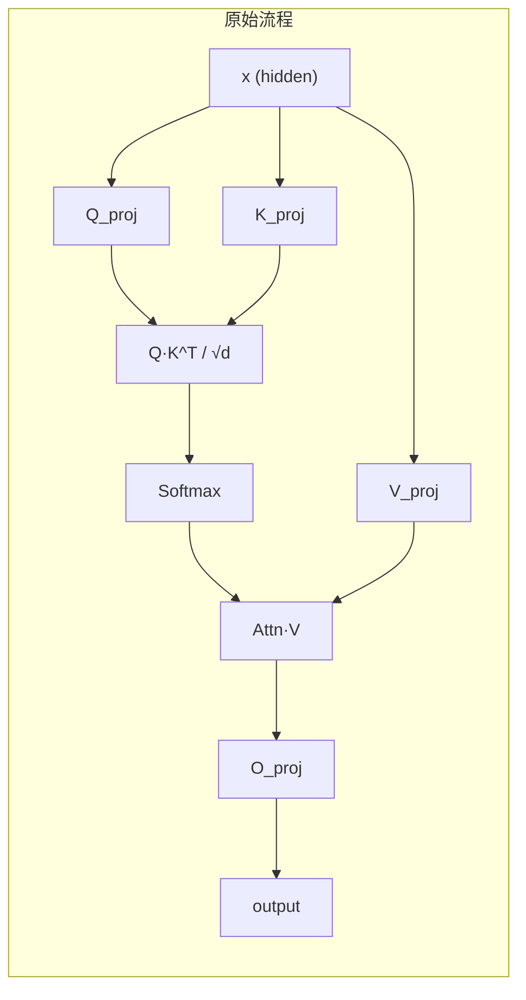
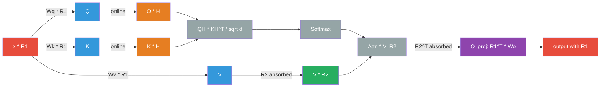
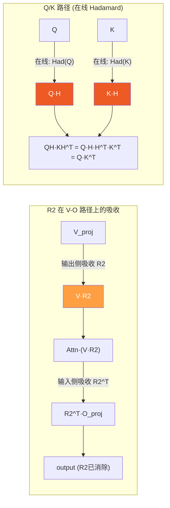

# SpinQuant 旋转矩阵在推理时的作用方式

## 总结

**$R_1$、$R_2$ 全部离线吸收到权重中，推理时零开销。唯一的在线操作是 Q/K 上的 Hadamard 变换（固定矩阵，非可学习参数，计算很快）。**

---

## Attention 层旋转吸收示意图

### 原始 Attention 计算流程 vs 插入旋转后



### 完整 Attention 层旋转吸收流程



**颜色说明**：🔴 输入/输出（带 $R_1$） · 🔵 QKV 投影（$R_1$ 已消除） · 🟠 在线 Hadamard · 🟢 $R_2$ 吸收 · 🟣 O_proj（$R_1^T$ 左乘 + $R_2^T$ 输入侧）

**关键路径**：
- **Q/K 路径**：$R_1$ 被 `W@R1` 吸收 → 在线 Hadamard → $H H^T = I$ 在点积中抵消，不影响 attention score
- **V-O 路径**：$R_1$ 被 `W@R1` 吸收 → $R_2$ 吸收到 V 输出侧 → $R_2^T$ 吸收到 O 输入侧 → $R_1^T$ 左乘 O 输出侧
- **输出**：O_proj 输出带 $R_1$，传给下一层的 LayerNorm + MLP

### $R_2$ 的吸收方式（注意力头维度）



**Q/K 路径**：两侧同时乘 Hadamard，在点积中 $H H^T = I$ 自动抵消，不影响 attention score。在线做 Hadamard 是为了量化 K cache 时分布更均匀。

### 完整的一层 Transformer 旋转吸收链路

```
                    R1 吸收到右侧           R1^T 吸收到左侧
                    ┌─────────┐             ┌──────────┐
 ┌──────────┐       │  Q_proj  │             │          │
 │Embedding │       │  K_proj  │──▶Attn ──▶ │  O_proj  │──▶(+residual)
 │  W@R1    │──▶ x·R1 ──▶      │             │ R1^T@W   │
 └──────────┘       │  V_proj  │             └──────────┘
  输出自带R1         │  W@R1    │                  │
                    └─────────┘                   ▼
                                             ┌──────────┐      ┌──────────┐
                                             │ gate/up  │──▶───│  down    │
                                             │  W@R1    │ MLP  │ R1^T@W   │──▶(+residual)──▶下一层...
                                             └──────────┘      └──────────┘
                                              R1 吸收到右侧     R1^T 吸收到左侧
```

**每个权重只吸收一侧**（左或右），$R_1$ 在相邻权重之间通过 $R_1 R_1^T = I$ 链式消除。

---

## $R_1$：隐藏层维度的旋转（全部离线吸收）

原始计算：$y = x \cdot W$，插入旋转后变成 $y' = (xR_1) \cdot W' = x \cdot (R_1 W')$

代码中的做法是**直接改权重**，推理时不需要额外操作：

| 操作 | 代码 | 效果 |
|------|------|------|
| Embedding | `W.weight = W @ R1` | 输出自带 $R_1$ 旋转 |
| Q/K/V proj | `W.weight = W @ R1` | 吸收输入侧的 $R_1$ |
| O proj | `W.weight = R1^T @ W` | 输出侧乘 $R_1^{-1}$ 还原，再给下一层 |
| MLP gate/up | `W.weight = W @ R1` | 吸收输入侧的 $R_1$ |
| MLP down | `W.weight = R1^T @ W` | 输出侧还原 |
| LM head | `W.weight = W @ R1` | 吸收最后的 $R_1$ |

本质上是利用 $R_1 R_1^T = I$，在相邻层之间"插入 $R_1 R_1^{-1} = I$"，然后把 $R_1$ 吸收到前一层的输出权重、$R_1^{-1}$ 吸收到后一层的输入权重。**推理时 activation 不需要任何在线旋转**。

---

## $R_2$：注意力头维度的旋转（也是离线吸收）

```python
# rotate_ov_proj（eval_utils/rotation_utils.py）: 
apply_exact_had_to_linear(v_proj, had_dim=head_dim, output=True, R2=R2)  # V输出侧吸收
apply_exact_had_to_linear(o_proj, had_dim=head_dim, output=False, R2=R2) # O输入侧吸收
```

$R_2$ 被吸收到 V_proj 的输出和 O_proj 的输入中。

### V 权重的最终形式

$R_1$ 和 $R_2$ 都被吸收进 V 的权重，但作用在**不同维度**上：

| 步骤 | 操作 | 作用维度 |
|------|------|---------|
| 1. 吸收 $R_1$ | $W_v \leftarrow W_v \cdot R_1$ | **输入侧**（hidden_dim，右乘） |
| 2. 吸收 $R_2$ | $W_v \leftarrow R_2^T \cdot W_v$ | **输出侧**（head_dim，左乘，per head 分块） |

最终存储的权重为：

$$W_{v,\text{final}} = R_{2,\text{block}}^T \cdot W_{v,\text{original}} \cdot R_1$$

> **注意**：不是 $W_v R_1 R_2$。$R_1$（`hidden_dim × hidden_dim`）和 $R_2$（`head_dim × head_dim`）维度不同，不能直接连乘。$R_2^T$ 从左边乘作用在输出维度，$R_1$ 从右边乘作用在输入维度。

从 activation 流向理解：$v' = (x \cdot R_1) \cdot W_v^T \cdot R_2$，两端的旋转矩阵分别被吸收到权重的两侧。

### O 权重的最终形式

O_proj 的情况与 V_proj **对称**，$R_2$ 和 $R_1$ 同样作用在不同维度：

| 步骤 | 操作 | 作用维度 |
|------|------|---------|
| 1. 吸收 $R_2$ | $W_o \leftarrow W_o \cdot R_2$ | **输入侧**（head_dim，右乘，per head 分块） |
| 2. 吸收 $R_1^T$ | $W_o \leftarrow R_1^T \cdot W_o$ | **输出侧**（hidden_dim，左乘） |

最终存储的权重为：

$$W_{o,\text{final}} = R_1^T \cdot W_{o,\text{original}} \cdot R_{2,\text{block}}$$

从 activation 流向理解，Attn·V 的输出带有 $R_2$，经过 O_proj 后需要还原并附上 $R_1$：

$$o = (\text{Attn} \cdot v') \cdot W_o^T \cdot R_1$$

其中输入侧的 $R_2$ 被 $W_o \cdot R_2$ 吸收（$R_2 \cdot R_2^T = I$ 消除），输出侧的 $R_1$ 被 $R_1^T \cdot W_o$ 吸收，使输出自带 $R_1$ 传给下一层。

---

## 唯一的"在线"操作：Q/K 的 Hadamard 变换

`QKRotationWrapper.forward`（`eval_utils/rotation_utils.py`）中有一个**在线操作**：

```python
q = HadamardTransform.apply(q.float()) / sqrt(head_dim)
k = HadamardTransform.apply(k.float()) / sqrt(head_dim)
```

但这**不是 $R_1$/$R_2$**，而是一个固定的 Hadamard 变换，应用在 Q 和 K 上。因为 Q 和 K 要做点积 $QK^T$，如果只旋转一侧可以吸收，但两侧同时旋转（$Q R_2 \cdot (K R_2)^T = Q R_2 R_2^T K^T = QK^T$）会互相抵消，所以 attention score 不受影响。这里的 Hadamard 是为了**量化 K cache** 时让数值分布更均匀，这部分确实是在线计算的，但 Hadamard 是固定矩阵，计算非常高效。
